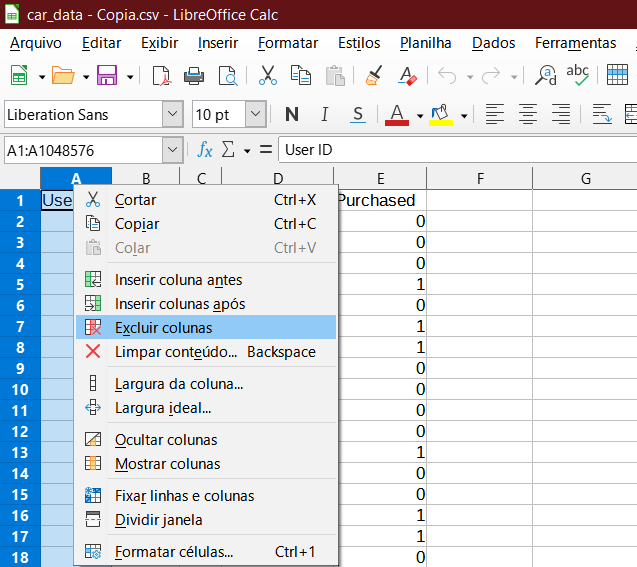

# Data Mining com CRISP-DM

## 1. **Entendimento do negócio**

### ****Carros - Conjunto de Dados de Decisão de Compra****

Este conjunto de dados contém detalhes de 1000 clientes, indicando se um cliente comprou ou não um carro.

**Fonte:** [Carros - Dataset de decisão de compra | Kaggle](https://www.kaggle.com/datasets/gabrielsantello/cars-purchase-decision-dataset)

## 2. **Entendimento dos dados**

- **Colunas**
    1. Purchased(Comprado) - Categórico;
    2. User ID - Numérico;
    3. Gender(Gênero) - Categórico;
    4. Age(Idade) - Numérico;
    5. AnnualSalary(Salário anual) - Numérico.
- **Linhas:** 1003.
    
    
    

 

### Dados estatísticos

- **Idade**
    
    Mínima***:*** 16 anos;
    
    Média/Mediana: 40 anos;
    
    Máxima: 110 Anos.
    

- **Salário anual**
    
    Mínima: 100;
    
    Média: 72 693;
    
    Mediana: 72 000;
    
    Máxima: 152 500.
    

- **Gênero**
    
    Compra feminino: 220;
    
    Não compra feminino: 297;
    
    Compra Masculino:184;
    
    Não compra masculino: 302.
    

## 3. **Preparação dos dados**

1. Excluindo coluna User ID:
    
    
    
2. Substituindo feminino por 0 e masculino por 1:
    
    
    
    
    
3. Detectando e deletando dados enviesados:
    
    
    
    
    

## 2.1 **Entendimento dos dados**

## 4. **Modelagem**

Métodos selecionados:

- Árvore;
- Rede neural.

## 5. **Avaliação do modelo**

Gerando dados para treino dos modelos:

Removida coluna purchased dos dados de teste:

Tabela com os dados para treino:

Resultado final do teste dos modelos, temos:

## 6. **Publicação**

***Link***: [***thiagopereiramagalhaes/Data-Mining-com-CRISP-DM (github.com)***](https://github.com/thiagopereiramagalhaes/Data-Mining-com-CRISP-DM)
